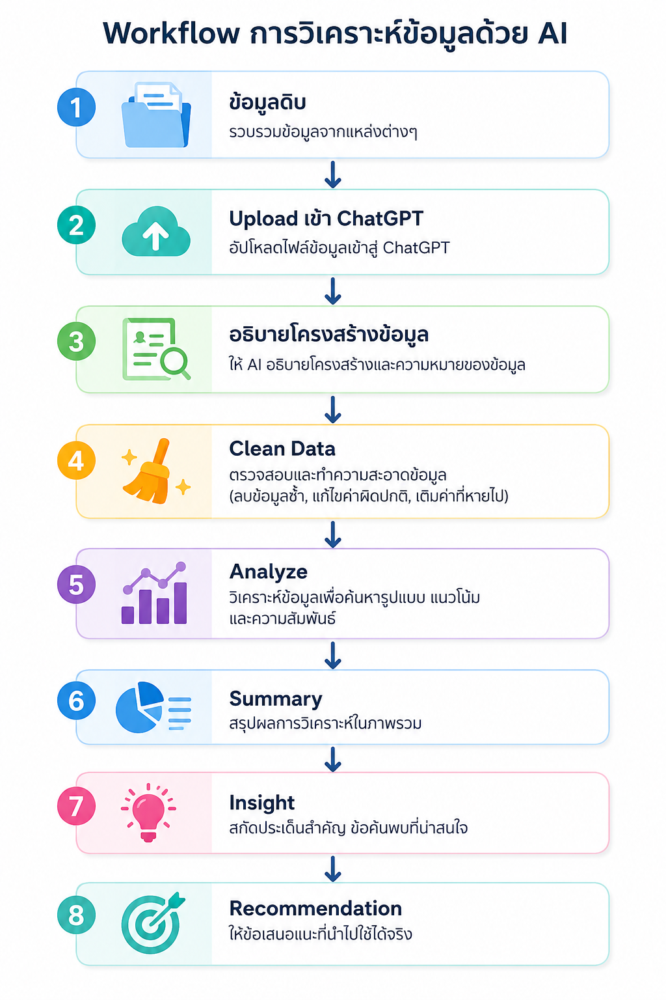

# Module 4 : ใช้ AI วิเคราะห์ข้อมูล (Data Analysis with ChatGPT)

# AI กับการวิเคราะห์ข้อมูล

หลายคนเข้าใจว่า ChatGPT ใช้ได้เฉพาะการเขียนเอกสารแต่จริง ๆ แล้ว ChatGPT สามารถช่วย

- วิเคราะห์ข้อมูล
- สรุปข้อมูล
- ค้นหารูปแบบ (Pattern)
- เปรียบเทียบข้อมูล
- สร้างกราฟ
- เขียนสูตร Excel
- เขียน SQL
- เขียน Python
- วิเคราะห์แนวโน้ม

ได้เช่นเดียวกัน

---

# ข้อมูลที่ AI วิเคราะห์ได้

ChatGPT สามารถวิเคราะห์ข้อมูลหลายรูปแบบ

| ประเภทข้อมูล | ตัวอย่าง |
|---------------|----------|
| Excel | xlsx |
| CSV | csv |
| PDF | รายงาน |
| Word | docx |
| Text | txt |
| Log File | log |
| JSON | json |
| XML | xml |
| SQL Export | sql |

---

# Workflow การวิเคราะห์ข้อมูล

---

# ตัวอย่างข้อมูล

Excel

| Product | Sales |
|----------|------|
| A | 500 |
| B | 650 |
| C | 200 |

AI สามารถ

- รวมยอด
- หาเฉลี่ย
- เปรียบเทียบ
- จัดอันดับ

ได้ทันที

---

# ขั้นตอนการวิเคราะห์ข้อมูล

## Step 1

Upload File

ลากไฟล์

- Excel
- CSV
- PDF

เข้า ChatGPT

---

## Step 2

ให้ AI อธิบายข้อมูล

Prompt

```
อธิบายโครงสร้างข้อมูลชุดนี้

มีทั้งหมดกี่คอลัมน์

แต่ละคอลัมน์หมายถึงอะไร
```

---

## Step 3

ตรวจสอบข้อมูล

Prompt

```
ตรวจสอบว่าข้อมูลชุดนี้

มี Missing Value หรือไม่

มีข้อมูลซ้ำหรือไม่

มีข้อมูลผิดปกติหรือไม่
```

---

## Step 4

เริ่มวิเคราะห์

Prompt

```
ช่วยวิเคราะห์ข้อมูลนี้

และสรุปประเด็นสำคัญ
```

---
