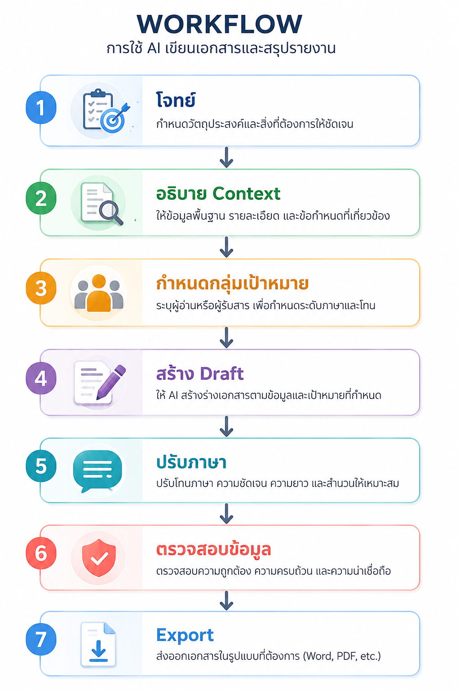

# Module 5 : ใช้ AI เขียนเอกสารและสรุปรายงาน (AI for Professional Writing)

# ทำไมต้องใช้ AI ช่วยเขียนเอกสาร

หลายองค์กรใช้เวลาจำนวนมากกับ

- เขียนรายงาน
- ตอบอีเมล
- สรุปรายงานประชุม
- เขียนข้อเสนอ
- เขียนหนังสือราชการ

ChatGPT สามารถช่วย

- ลดเวลา
- ลดข้อผิดพลาด
- ช่วยเรียบเรียงภาษา
- ช่วยสรุปประเด็นสำคัญ
- ช่วยตรวจสอบไวยากรณ์

---

# งานเอกสารที่ ChatGPT ช่วยได้

| ประเภท | ตัวอย่าง |
|---------|-----------|
| Email | ตอบลูกค้า ตอบผู้บริหาร |
| รายงาน | Weekly Report, Monthly Report |
| Proposal | เสนอโครงการ |
| หนังสือราชการ | หนังสือภายใน หนังสือภายนอก |
| รายงานประชุม | Meeting Minutes |
| SOP | คู่มือการทำงาน |
| คู่มือ | User Manual |
| ข่าวประชาสัมพันธ์ | Announcement |
| บทความ | Article |
| สุนทรพจน์ | Speech |

---

# Workflow การใช้ AI เขียนเอกสาร


---

# หลักการเขียน Prompt

ควรระบุ

- Role
- Context
- Objective
- Target Audience
- Tone
- Output

ตัวอย่าง

```
คุณคือเลขานุการผู้บริหาร

ช่วยเขียนอีเมล

เชิญประชุม

ถึงผู้จัดการทุกฝ่าย

ใช้ภาษาทางการ

ไม่เกิน 1 หน้า
```

---

# การเขียน Email

## ตัวอย่าง

Prompt

```
ช่วยเขียน Email

แจ้งเลื่อนประชุม

จากวันที่ 15

เป็นวันที่ 20 กรกฎาคม

ใช้ภาษาสุภาพ
```

---

## ปรับระดับภาษา

```
ช่วยทำให้ Email นี้

เป็นทางการมากขึ้น
```

---

```
ช่วยทำให้ Email นี้

เป็นมิตร

อ่านง่าย
```

---

```
ช่วยย่อ Email

ให้เหลือไม่เกิน

150 คำ
```

---

# การเขียนรายงาน

Prompt

```
ช่วยเขียนรายงาน

ผลการดำเนินงาน

โครงการอบรม AI

สำหรับผู้บริหาร

ความยาวประมาณ

2 หน้า
```

---

# Executive Summary

Prompt

```
ช่วยเขียน Executive Summary

จากรายงานนี้

ให้ผู้บริหารอ่านภายใน

2 นาที
```

---

# การสรุปรายงาน

Upload

report.pdf

Prompt

```
ช่วยสรุปรายงานนี้

เหลือไม่เกิน

10 Bullet
```

---

# การสรุปรายงานประชุม

Upload

meeting.pdf

Prompt

```
ช่วยสรุปรายงานประชุม

พร้อม

- Agenda

- Decision

- Action Item

- Owner

- Due Date
```

---

# Action Item

ChatGPT สามารถสกัด

สิ่งที่ต้องดำเนินการ

เช่น

| งาน | ผู้รับผิดชอบ | กำหนดเสร็จ |
|------|--------------|------------|
| จัดซื้อ Server | IT | 30 ก.ค. |
| ออกแบบ Network | Infrastructure | 10 ส.ค. |

---

# การเขียน Proposal

Prompt

```
ช่วยเขียน

Proposal

ติดตั้งระบบ Virtualization

สำหรับบริษัทขนาดกลาง

ประกอบด้วย

- Background

- Objective

- Scope

- Timeline

- Deliverables
```

---

# การเขียนหนังสือราชการ

Prompt

```
ช่วยเขียนหนังสือราชการ

ขออนุมัติจัดอบรม

เรื่อง

การประยุกต์ใช้ AI

ใช้ภาษาราชการ
```

---

# หนังสือภายใน

Prompt

```
ช่วยเขียน

บันทึกข้อความ

แจ้งเปลี่ยนสถานที่ประชุม

ภาษาราชการ
```

---

# การสร้างคู่มือ

Prompt

```
ช่วยเขียนคู่มือ

การใช้งานระบบ

สำหรับผู้เริ่มต้น

ใช้ Markdown
```

---

# การเขียนข่าวประชาสัมพันธ์

Prompt

```
ช่วยเขียน

ข่าวประชาสัมพันธ์

เปิดอบรม AI

สำหรับบุคลากร
```

---

# การปรับภาษา

Prompt

```
ช่วยทำให้ข้อความนี้

เป็นทางการ
```

---

```
ช่วยทำให้อ่านง่ายขึ้น
```

---

```
ช่วยตรวจไวยากรณ์
```

---

```
ช่วยแก้คำผิด
```

---

```
ช่วยทำให้น่าเชื่อถือขึ้น
```

---

# การแปลภาษา

Prompt

```
แปลเป็นภาษาอังกฤษ

โดยใช้ภาษาเชิงธุรกิจ
```

---

```
แปลเป็นภาษาจีน

ให้สุภาพ
```

---

# การตรวจเอกสาร

Prompt

```
ช่วยตรวจสอบเอกสารนี้

ว่ามี

- คำผิด

- ประโยคซ้ำ

- ข้อมูลขัดแย้ง

- จุดที่ควรปรับปรุง
```

---

# เปรียบเทียบเอกสาร

Prompt

```
เปรียบเทียบ

เอกสารทั้งสองฉบับ

ว่ามีความแตกต่างตรงไหน
```

---

# Workshop : สร้างเอกสารจากโจทย์จริง

---

# LAB 1 : เขียน Email

โจทย์

แจ้งเลื่อนประชุม

จาก

15 กรกฎาคม

เป็น

20 กรกฎาคม

เวลาเดิม

Prompt

```
ช่วยเขียน Email

แจ้งเลื่อนประชุม

ใช้ภาษาทางการ
```

อภิปราย

Email อ่านง่ายหรือไม่

---

# LAB 2 : เขียนรายงาน

โจทย์

สรุปผลการอบรม

Prompt

```
ช่วยเขียนรายงาน

สรุปผลการอบรม

AI สำหรับบุคลากร

ประกอบด้วย

- วัตถุประสงค์

- ผลการดำเนินงาน

- ปัญหา

- ข้อเสนอแนะ
```

---

# LAB 3 : สรุปรายงานประชุม

Upload

meeting.pdf

Prompt

```
ช่วยสรุปรายงานประชุม

เหลือ

1 หน้า

พร้อม

Action Items
```

อภิปราย

Action Item ครบหรือไม่

---

# LAB 4 : เขียนหนังสือราชการ

โจทย์

ขออนุมัติจัดซื้อ Server

Prompt

```
ช่วยเขียนหนังสือราชการ

ขออนุมัติจัดซื้อ Server

ใช้ภาษาราชการ
```

อภิปราย

รูปแบบถูกต้องหรือไม่

---

# LAB 5 : ปรับปรุงเอกสาร

นำเอกสารเก่าของตนเอง

Prompt

```
ช่วยปรับภาษา

ให้อ่านง่าย

เป็นทางการ

และกระชับขึ้น
```

เปรียบเทียบ

ก่อนและหลัง

---

# LAB 6 : เปรียบเทียบเอกสาร

Upload

Version 1

Version 2

Prompt

```
ช่วยเปรียบเทียบ

เอกสารสองฉบับ

สรุป

- สิ่งที่เพิ่ม

- สิ่งที่ลบ

- สิ่งที่เปลี่ยน
```

---

# LAB 7 : สร้าง Proposal

โจทย์

ติดตั้งระบบ Backup

Prompt

```
ช่วยสร้าง Proposal

ติดตั้งระบบ Backup

สำหรับองค์กร

มีหัวข้อ

- Background

- Scope

- Timeline

- Deliverables

- Benefits
```

---

# Workshop Challenge

ให้ผู้เรียนเลือกงานจริงของตนเอง

เช่น

- Email
- รายงาน
- Proposal
- หนังสือราชการ
- คู่มือ
- Minutes of Meeting

ใช้ ChatGPT

สร้าง Draft

ปรับปรุงอย่างน้อย

3 รอบ

แล้วนำเสนอ

---

# Best Practices

- ให้ข้อมูลครบถ้วนก่อนสั่ง AI
- ระบุกลุ่มผู้อ่านให้ชัดเจน
- ระบุระดับภาษา
- ตรวจสอบข้อเท็จจริงก่อนส่ง
- อย่าใช้ AI แทนการตรวจทาน
- ให้ผู้เกี่ยวข้องตรวจสอบเอกสารก่อนใช้งานจริง

---

# Prompt Templates

## Email

```
ช่วยเขียน Email

หัวข้อ...

ผู้รับ...

วัตถุประสงค์...

ใช้ภาษาทางการ

ไม่เกิน...
```

---

## รายงาน

```
ช่วยเขียนรายงาน

หัวข้อ...

สำหรับ...

ความยาว...

ใช้ภาษา...
```

---

## หนังสือราชการ

```
ช่วยเขียนหนังสือราชการ

เรื่อง...

วัตถุประสงค์...

ใช้ภาษาราชการ
```

---

## รายงานประชุม

```
ช่วยสรุปรายงานประชุม

พร้อม

- Agenda

- Decision

- Action Item

- Owner

- Due Date
```

---

## Executive Summary

```
ช่วยเขียน Executive Summary

สำหรับผู้บริหาร

ไม่เกิน 1 หน้า
```

---
