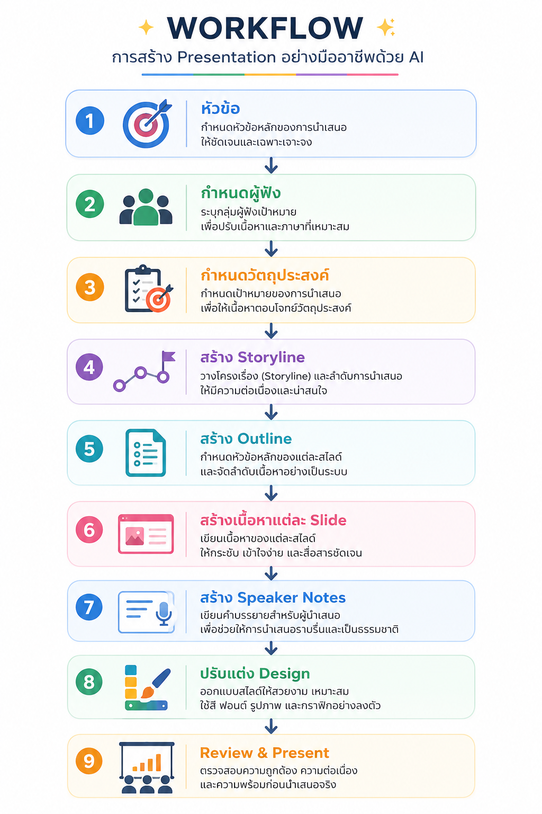

# Module 6 : ใช้ AI สร้าง Presentation (AI for Presentation Design)

# ทำไมต้องใช้ AI สร้าง Presentation

ปัญหาที่พบ

- ไม่รู้จะเริ่มต้นอย่างไร
- คิดหัวข้อไม่ออก
- เรียงเนื้อหาไม่เป็น
- เนื้อหาเยอะเกินไป
- สไลด์อ่านยาก
- ใช้เวลาหลายชั่วโมง

AI สามารถช่วย

- คิดโครงสร้าง
- เรียงลำดับเนื้อหา
- เขียนข้อความ
- สรุปข้อมูล
- สร้าง Speaker Notes
- ช่วยออกแบบ Slide Layout

---

# AI ช่วยอะไรได้บ้าง

| งาน | ChatGPT |
|------|----------|
| คิดหัวข้อ | ✅ |
| วาง Storyline | ✅ |
| เขียนเนื้อหา | ✅ |
| สรุปข้อมูล | ✅ |
| เขียน Speaker Notes | ✅ |
| ออกแบบลำดับสไลด์ | ✅ |
| สร้าง Prompt สำหรับ AI สร้างภาพ | ✅ |
| ช่วยเลือก Diagram | ✅ |

---

# Workflow การสร้าง Presentation


---

# เริ่มต้นด้วย Storyline

Presentation ที่ดี

ไม่ได้เริ่มจาก PowerPoint

แต่เริ่มจาก

Story

---

ตัวอย่าง

หัวข้อ

```
AI สำหรับองค์กร
```

Storyline

```
ปัญหา

↓

ทำไมต้องใช้ AI

↓

AI คืออะไร

↓

Use Case

↓

Demo

↓

ผลลัพธ์

↓

Q&A
```

---

# กำหนดกลุ่มผู้ฟัง

Prompt

```
Presentation นี้

นำเสนอให้

CEO

ควรมีเนื้อหาอะไรบ้าง
```

หรือ

```
Presentation นี้

สำหรับนักศึกษา

ควรใช้ภาษาแบบใด
```

---

# กำหนดจำนวนสไลด์

Prompt

```
ช่วยสร้าง Presentation

10 Slide

เกี่ยวกับ

Cyber Security

สำหรับผู้บริหาร
```

---

# สร้าง Outline

Prompt

```
ช่วยสร้าง Outline

Presentation

เรื่อง

Cloud Computing

จำนวน

10 Slide
```

ตัวอย่าง

```
Slide 1

Title

Slide 2

Agenda

Slide 3

Current Problem

Slide 4

Solution

Slide 5

Architecture

Slide 6

Benefits

Slide 7

Implementation

Slide 8

Cost

Slide 9

Summary

Slide 10

Q&A
```

---

# สร้างเนื้อหาแต่ละสไลด์

Prompt

```
ช่วยเขียน

เนื้อหา

Slide 4

หัวข้อ

Cloud Architecture

ใช้ Bullet

ไม่เกิน

6 ข้อ
```

---

# กฎ 6 × 6

Presentation ที่ดี

ไม่ควรใส่ข้อความมากเกินไป

แนะนำ

- ไม่เกิน 6 Bullet

- Bullet ละไม่เกิน 6 คำ

---

# เขียน Speaker Notes

Prompt

```
ช่วยเขียน

Speaker Notes

สำหรับ Slide นี้

ใช้เวลาพูด

2 นาที
```

---

# การย่อข้อความ

Prompt

```
ช่วยย่อข้อความนี้

ให้เหมาะสำหรับ

PowerPoint
```

---

# การเปลี่ยนข้อความเป็น Bullet

Prompt

```
เปลี่ยนข้อความนี้

ให้เป็น Bullet
```

---

# การสร้าง Theme

Prompt

```
ช่วยแนะนำ

Theme

สำหรับ

Presentation

ด้าน IT

ให้ดู Professional
```

---

# การใช้ AI ช่วยตรวจ Presentation

Prompt

```
ช่วยตรวจ Presentation นี้

ว่ามี

- Slide ซ้ำ

- ข้อความเยอะเกิน

- ลำดับไม่ดี

- ควรปรับปรุงอะไร
```

---

# การสรุป Presentation

Prompt

```
ช่วยสรุป

Presentation

เหลือ

5 Slide
```

---

# การแปล Presentation

Prompt

```
แปล Presentation นี้

เป็นภาษาอังกฤษ

สำหรับงานประชุมนานาชาติ
```

---

# Workshop Challenge

เลือกหัวข้อจริงของตนเอง

เช่น

- Company Profile
- Project Proposal
- AI Training
- Cloud Migration
- Virtualization
- Database Migration
- Cyber Security

ให้ ChatGPT ช่วยสร้าง

1. Storyline

2. Outline

3. Slide Content

4. Speaker Notes

5. รูปแบบ Diagram

6. Prompt สำหรับสร้างภาพประกอบ

7. Checklist ก่อนนำเสนอ

จากนั้นนำไปสร้าง Presentation ใน PowerPoint

---

# Best Practices

- เริ่มจาก Story ไม่ใช่เริ่มจาก Slide
- 1 Slide = 1 ประเด็นหลัก
- ใช้ Bullet แทน Paragraph
- ใช้ภาพมากกว่าข้อความ
- จำกัดข้อความให้อ่านภายใน 30 วินาที
- ใช้สีและฟอนต์อย่างสม่ำเสมอ
- ใช้ Speaker Notes แทนการใส่ข้อความยาวบนสไลด์
- ให้ AI ช่วยตรวจสอบลำดับการเล่าเรื่องก่อนนำเสนอ

---

# Prompt Templates

## Outline

```
ช่วยสร้าง Presentation

หัวข้อ...

สำหรับ...

จำนวน... Slide
```

---

## Slide Content

```
ช่วยเขียน

Slide ...

หัวข้อ...

ใช้ Bullet

ไม่เกิน 6 ข้อ
```

---

## Speaker Notes

```
ช่วยเขียน Speaker Notes

สำหรับ Slide นี้

ใช้เวลาพูดประมาณ 2 นาที
```

---

## Diagram

```
ช่วยออกแบบ Diagram

เรื่อง...

สำหรับ PowerPoint

ใช้ Flat Vector Style
```

---

## AI Image Prompt

```
ช่วยสร้าง Prompt

สำหรับ AI Image

Modern Flat Vector

Minimal

16:9

Blue Theme
```

---

## Presentation Review

```
ช่วยตรวจ Presentation นี้

ด้าน

- Storyline

- Design

- Readability

- Timing

- จุดที่ควรปรับปรุง
```

---
