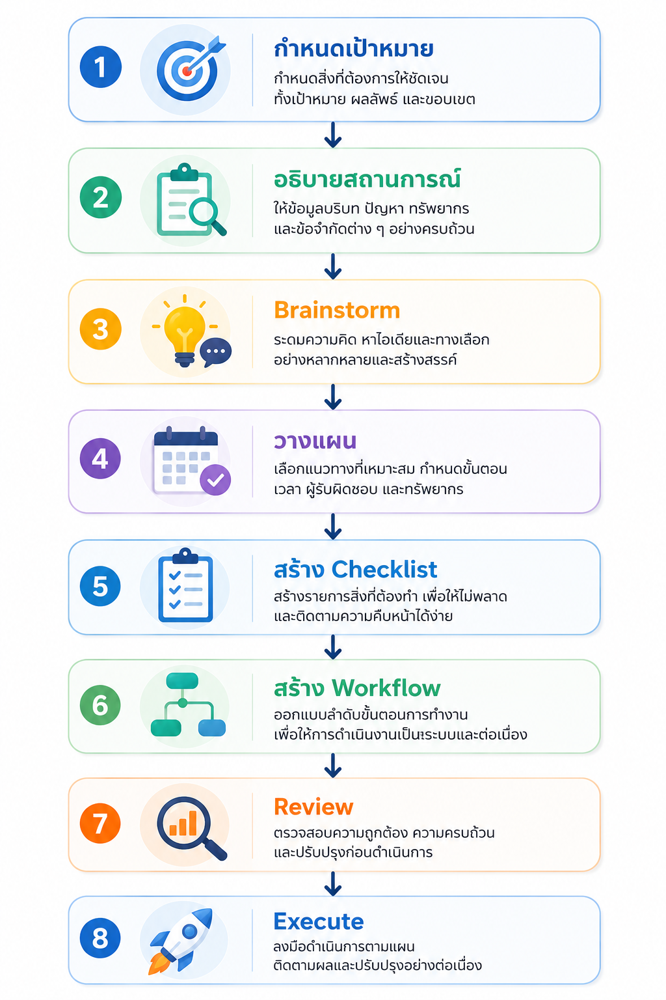

# Module 8 : ใช้ AI ให้เหมือนมีผู้ช่วยส่วนตัว (Personal AI Assistant)

# Learning Objectives

เมื่อเรียนจบบทนี้ ผู้เรียนจะสามารถ

- ใช้ ChatGPT เป็นผู้ช่วยในการทำงานประจำวัน
- ใช้ AI เพื่อ Brainstorm ไอเดียได้อย่างมีประสิทธิภาพ
- ใช้ AI ช่วยวางแผนโครงการและแผนการทำงาน
- สร้าง Checklist และ Workflow สำหรับงานต่าง ๆ
- ออกแบบ Personal AI Assistant ให้เหมาะกับสายงานของตนเอง
- สร้าง Prompt Library สำหรับใช้งานซ้ำ

---

# สิ่งที่ต้องเตรียม

- ChatGPT
- Browser
- Microsoft Word หรือ Notion
- งานจริงของผู้เรียน เช่น
  - โครงการ
  - รายงาน
  - งานประจำ
  - แผนงาน
  - To-do List

---

# Personal AI Assistant คืออะไร

Personal AI Assistant

คือ

> การใช้ ChatGPT เป็น "ผู้ช่วยส่วนตัว" ที่ช่วยคิด วางแผน วิเคราะห์ และจัดการงานประจำวัน

AI ไม่ได้แทนที่ผู้ใช้

แต่ช่วยลดงานซ้ำ ๆ

ทำให้ผู้ใช้มีเวลาไปทำงานที่สำคัญกว่า

---

# AI ช่วยงานอะไรได้บ้าง

| งาน | AI ช่วยได้ |
|------|------------|
| Brainstorm | ✅ |
| วางแผนโครงการ | ✅ |
| จัดลำดับงาน | ✅ |
| Checklist | ✅ |
| Roadmap | ✅ |
| Timeline | ✅ |
| Risk Analysis | ✅ |
| สรุปรายงาน | ✅ |
| เขียนอีเมล | ✅ |
| เตรียมประชุม | ✅ |
| ถอดบทเรียน | ✅ |
| Decision Support | ✅ |

---

# Workflow การใช้ AI เป็นผู้ช่วยส่วนตัว



---

# ใช้ AI ช่วย Brainstorm

Prompt

```
ช่วย Brainstorm

ไอเดียการจัดอบรม AI

สำหรับพนักงานบริษัท

จำนวนอย่างน้อย

20 ไอเดีย
```

---

# Brainstorm แบบมีเงื่อนไข

Prompt

```
ช่วยคิด

10 วิธี

ลดค่าใช้จ่ายด้าน IT

โดยใช้งบประมาณต่ำ

และสามารถดำเนินการได้ภายใน 6 เดือน
```

---

# ใช้ AI ช่วยวางแผนโครงการ

Prompt

```
ช่วยวางแผนโครงการ

ติดตั้งระบบ Virtualization

ระยะเวลา

3 เดือน

ทีมงาน

5 คน
```

---

# สร้าง Work Breakdown Structure (WBS)

Prompt

```
ช่วยแบ่งงาน

ติดตั้งระบบ Backup

ออกเป็น

Work Breakdown Structure

พร้อมลำดับงาน
```

---

# สร้าง Timeline

Prompt

```
ช่วยสร้าง Timeline

โครงการ

Migration Database

ระยะเวลา

6 เดือน

พร้อม Milestone
```

---

# สร้าง Checklist

Prompt

```
ช่วยสร้าง Checklist

ก่อนติดตั้ง

RedHat Linux

สำหรับ Production
```

---

# สร้าง SOP

Prompt

```
ช่วยสร้าง SOP

การ Backup Oracle Database

แบบ Step by Step
```

---

# สร้าง Workflow

Prompt

```
ช่วยสร้าง Workflow

การขออนุมัติจัดซื้อ Server
```

---

# วิเคราะห์ความเสี่ยง

Prompt

```
ช่วยวิเคราะห์

Risk

ของโครงการ

Cloud Migration

พร้อม

Risk Matrix
```

---

# ช่วยตัดสินใจ

Prompt

```
ช่วยเปรียบเทียบ

VMware

KVM

Proxmox

เพื่อช่วยตัดสินใจ

สำหรับองค์กรขนาดกลาง
```

---

# สร้าง To-do List

Prompt

```
ช่วยสร้าง

To-do List

สำหรับผู้จัดอบรม

ก่อนวันอบรม

1 เดือน
```

---

# จัดลำดับความสำคัญ

Prompt

```
ช่วยจัดลำดับ

งานต่อไปนี้

ตามความสำคัญ

โดยใช้

Eisenhower Matrix
```

---

# ใช้ AI ช่วยประชุม

Prompt

```
ช่วยเตรียม Agenda

ประชุมทีม

เรื่อง

AI Project
```

---

# หลังประชุม

Prompt

```
ช่วยสรุป

Minutes of Meeting

พร้อม

Action Item

Owner

Due Date
```

---

# AI ช่วยคิดคำถาม

Prompt

```
ช่วยคิด

คำถามที่ควรถาม

ลูกค้า

ก่อนเริ่มโครงการ
```

---

# AI ช่วยเป็นที่ปรึกษา

Prompt

```
คุณคือ CIO

ช่วยให้คำแนะนำ

เกี่ยวกับ

Digital Transformation
```

---

# AI ช่วยเรียนรู้

Prompt

```
ช่วยสร้าง

Learning Roadmap

Linux

สำหรับผู้เริ่มต้น

ระยะเวลา

6 เดือน
```

---

# AI ช่วยสร้างแผนพัฒนา

Prompt

```
ช่วยสร้าง

Individual Development Plan

สำหรับ

System Administrator
```

---

# Prompt Library

ควรสร้าง Prompt ที่ใช้บ่อย

เช่น

```
เขียน Email

สรุปรายงาน

สร้าง Checklist

วิเคราะห์ข้อมูล

สร้าง Presentation

สร้าง Proposal
```

เก็บไว้ใช้ซ้ำ

---

# Personal AI Workspace

ตัวอย่าง

```
Daily Tasks

↓

Meeting

↓

Summary

↓

Action Items

↓

Next Plan
```

สามารถใช้ ChatGPT เป็นศูนย์กลางในการจัดการงานประจำวัน

---

# ตัวอย่าง AI Assistant ตามสายงาน

## System Administrator

- วิเคราะห์ Log
- เขียน Script
- Troubleshooting
- ตรวจสอบ Configuration
- เขียน SOP

---

## Project Manager

- Timeline
- Risk
- WBS
- Meeting Minutes
- Checklist

---

## HR

- Job Description
- Interview Questions
- Training Plan
- KPI
- Competency Matrix

---

## Marketing

- Campaign
- Content Calendar
- Social Media
- Customer Persona

---

## ผู้บริหาร

- Executive Summary
- Dashboard
- SWOT
- Business Strategy
- Decision Matrix

---

# Workshop : สร้าง Personal AI Assistant

---

# LAB 1 : Brainstorm

โจทย์

```
จัดอบรม AI
```

Prompt

```
ช่วย Brainstorm

20 ไอเดีย

สำหรับการจัดอบรม AI
```

อภิปราย

AI เสนอไอเดียที่น่าสนใจหรือไม่

---

# LAB 2 : วางแผนโครงการ

โจทย์

```
ติดตั้ง KVM Cluster
```

Prompt

```
ช่วยวางแผน

โครงการ

KVM Cluster

ระยะเวลา

2 เดือน

ทีมงาน

4 คน
```

---

# LAB 3 : สร้าง Checklist

Prompt

```
ช่วยสร้าง Checklist

การติดตั้ง

RedHat Enterprise Linux

สำหรับ Production
```

---

# LAB 4 : สร้าง Workflow

โจทย์

```
Database Backup
```

Prompt

```
ช่วยสร้าง Workflow

Database Backup

แบบ Step by Step
```

---

# LAB 5 : วิเคราะห์ความเสี่ยง

Prompt

```
ช่วยวิเคราะห์

Risk

ของโครงการ

PostgreSQL Migration

พร้อมเสนอ

วิธีลดความเสี่ยง
```

---

# LAB 6 : ช่วยประชุม

โจทย์

ประชุมทีมติดตั้งระบบ

Prompt

```
ช่วยสร้าง

Agenda

และ

Checklist

ก่อนประชุม
```

หลังประชุม

```
ช่วยสรุป

Minutes of Meeting

พร้อม

Action Item
```

---

# LAB 7 : AI ที่ปรึกษา

Prompt

```
คุณคือ

Senior IT Consultant

ช่วยให้คำแนะนำ

การเลือก

Virtualization Platform

สำหรับองค์กร
```

เปรียบเทียบผลลัพธ์

เมื่อเปลี่ยน Role เป็น

- CIO
- CTO
- Linux Architect
- Project Manager

---

# LAB 8 : สร้าง Prompt Library

ผู้เรียนสร้าง Prompt ที่ใช้บ่อย

อย่างน้อย

10 Prompt

เช่น

- เขียน Email
- สร้าง Checklist
- วิเคราะห์ข้อมูล
- สร้าง Presentation
- วางแผนโครงการ
- เขียน SOP
- สรุปรายงาน
- วิเคราะห์ความเสี่ยง
- สร้าง Roadmap
- สร้าง Proposal

---

# LAB 9 : สร้าง Personal AI Assistant

ออกแบบ AI Assistant

ของตนเอง

เช่น

```
System Administrator Assistant

Project Manager Assistant

HR Assistant

Marketing Assistant

Teacher Assistant

Research Assistant
```

กำหนด

- หน้าที่
- Prompt หลัก
- Workflow
- Checklist
- Template

---

# Workshop Challenge

เลือกงานจริงของตนเอง

ให้ ChatGPT ช่วย

1. Brainstorm

2. วางแผน

3. สร้าง Timeline

4. สร้าง Checklist

5. วิเคราะห์ Risk

6. สร้าง Workflow

7. สรุปรายงาน

8. เขียน Email

9. สร้าง Presentation

รวมทั้งหมดเป็น

"Personal AI Workspace"

---

# Prompt Templates

## Brainstorm

```
ช่วย Brainstorm

หัวข้อ...

จำนวน...

โดยมีข้อจำกัด...
```

---

## Project Plan

```
ช่วยวางแผนโครงการ

หัวข้อ...

ระยะเวลา...

ทีมงาน...

เป้าหมาย...
```

---

## Checklist

```
ช่วยสร้าง Checklist

สำหรับ...

แบ่งตามลำดับขั้นตอน
```

---

## Workflow

```
ช่วยสร้าง Workflow

ของ...

พร้อมอธิบายแต่ละขั้นตอน
```

---

## Risk Analysis

```
ช่วยวิเคราะห์ความเสี่ยง

ของโครงการ...

พร้อมเสนอแนวทางลดความเสี่ยง
```

---

## Decision Support

```
ช่วยเปรียบเทียบ

ทางเลือก...

โดยสรุปข้อดี ข้อเสีย ความเสี่ยง และข้อเสนอแนะ
```

---
